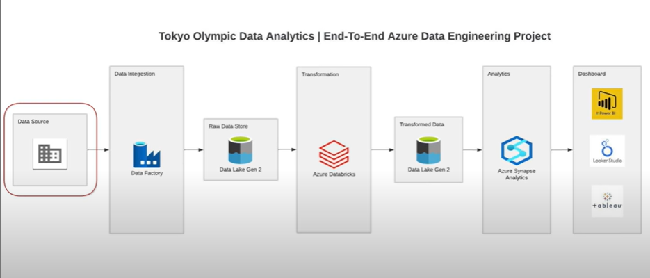
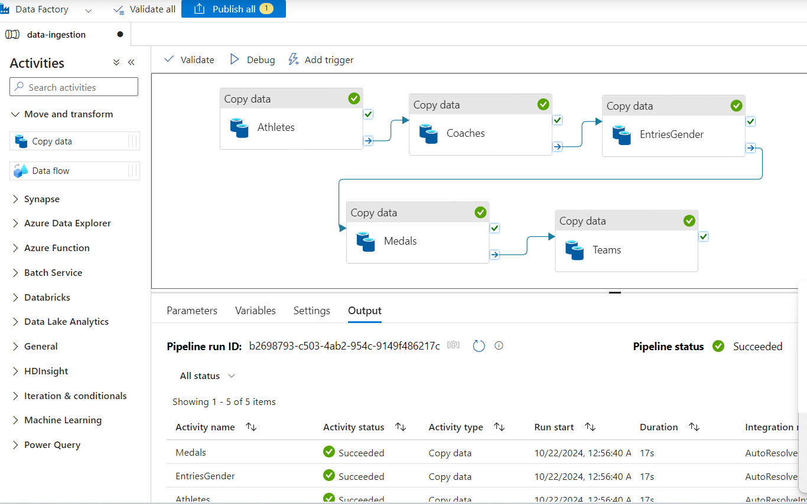
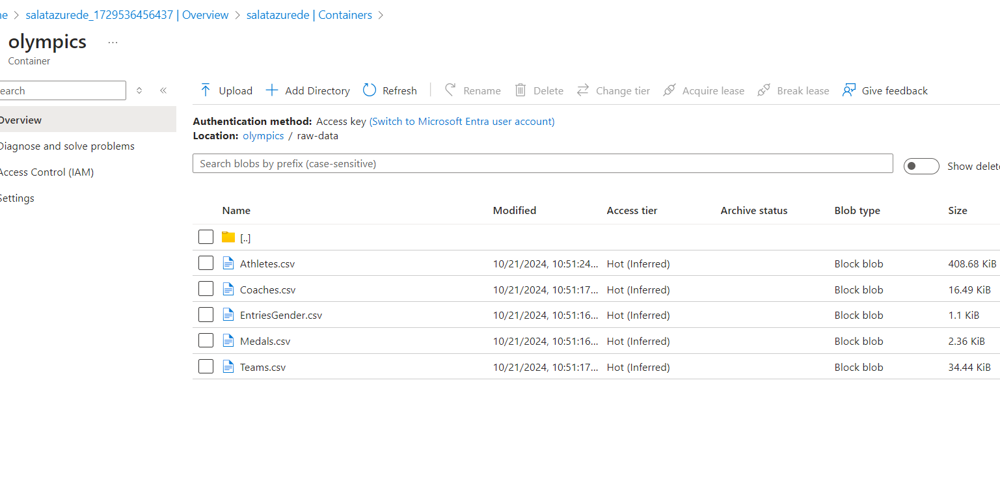
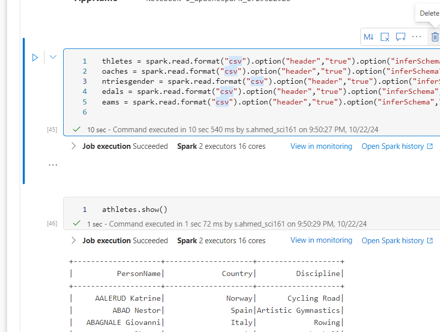
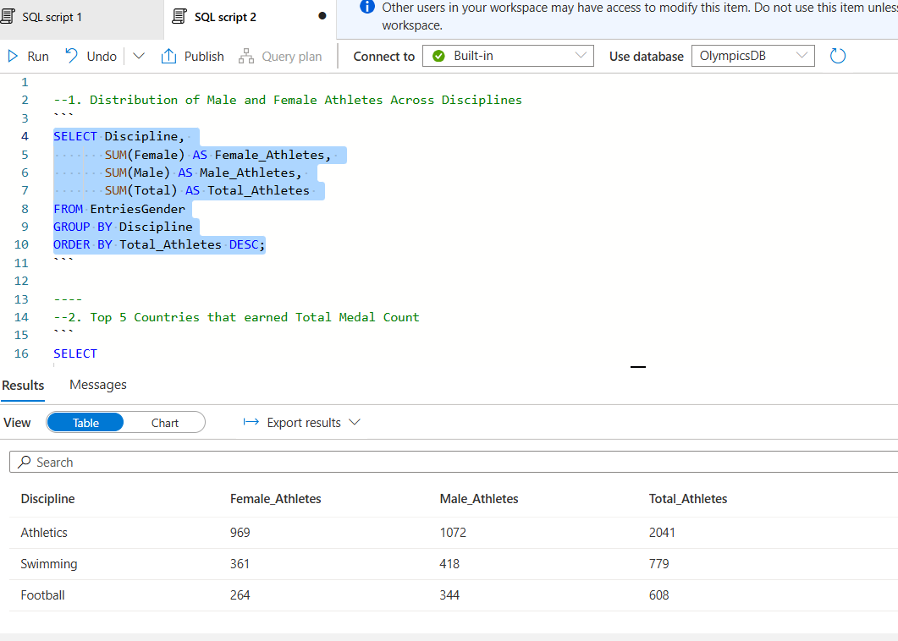
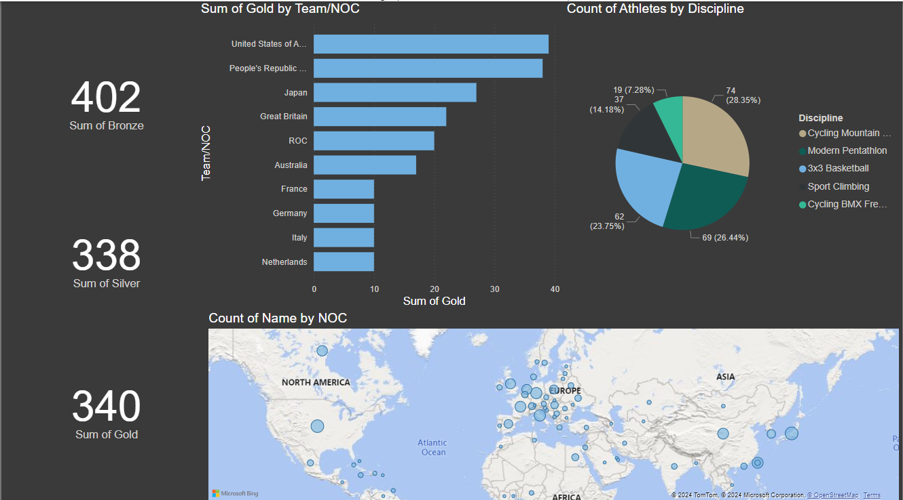

# Tokyo Olympic Data Analytics | End-to-End Azure Data Engineering Project

This project demonstrates an end-to-end data engineering pipeline for analyzing Tokyo Olympic data using Microsoft Azure. The pipeline includes data ingestion, storage, transformation, analytics, and visualization.

## Project Overview
The goal of this project is to build a data engineering pipeline that pulls data from a source, stores it, transforms it for analysis, and visualizes insights. This project utilizes various Azure services such as Azure Data Factory, Data Lake Gen2, Azure Databricks, Azure Synapse Analytics, and Power BI for data integration, storage, transformation, analytics, and visualization.

## Architecture

Data Source: Data is sourced from a GitHub repository.  
Data Ingestion: Azure Data Factory (ADF) extracts data from GitHub and loads it into Data Lake Gen2 (Raw Data Store).  
Data Storage: Raw data is stored in Azure Data Lake Gen2. 
Data Transformation: Azure Databricks is used to process and transform raw data into a clean format. 
Data Analytics: Transformed data is loaded into Azure Synapse Analytics for further analysis. 
Data Visualization: Insights are visualized in Power BI. 

## Technologies Used
Azure Data Factory: For data ingestion from GitHub to Data Lake. 
Azure Data Lake Storage Gen2: For raw and transformed data storage. 
Azure Databricks: For data transformation using Spark. 
Azure Synapse Analytics: For data analytics and querying. 
Power BI: For data visualization and dashboarding. 

### 1. Data Ingestion

Tool: Azure Data Factory 
Process: 
Data is ingested from GitHub (http source) and loaded into a raw data store in Azure Data Lake Gen2. 
ADF pipelines are used to automate the data extraction process, ensuring up-to-date data is available. 

### 2. Data Storage

Tool: Azure Data Lake Storage Gen2 
Process: 
Raw data from ADF is stored in a raw data folder in Data Lake. 
This raw data store serves as a source for further transformations and analytics. 

### 3. Data Transformation

Tool: Azure Databricks 
Process: 
Databricks is used to process and transform data using Spark. 
Transformations include data cleaning, aggregation, and preparing the data for analytics. 
Transformed data is saved back into Data Lake Gen2 in a structured format for analytics. 

### 4. Data Analytics

Tool: Azure Synapse Analytics 
Process: 
Transformed data from Data Lake Gen2 is analyzed in Synapse. 
Synapse provides the capability to run complex queries and perform data aggregations. 
Analytical insights are derived from the prepared data. 

### 5. Data Visualization

Tool: Power BI 
Process: 
Power BI connects to Azure Synapse Analytics to visualize the analyzed data. 
Visualizations include dashboards that display insights and trends for Tokyo Olympic data. 

